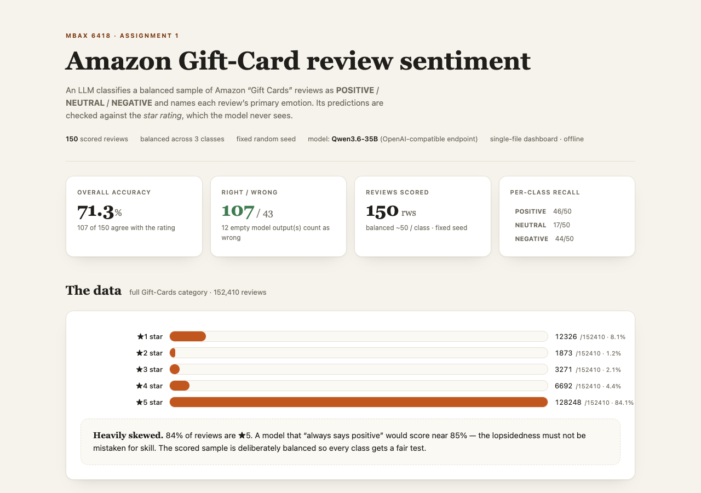
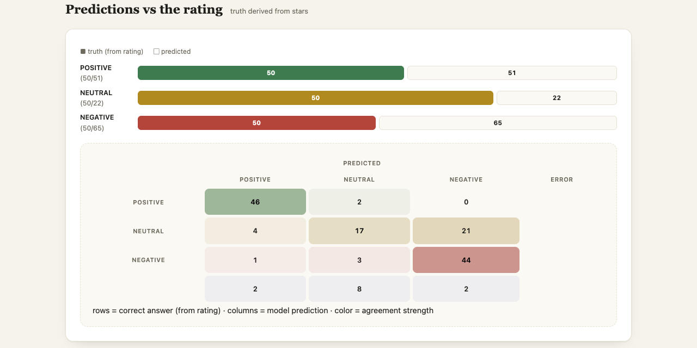
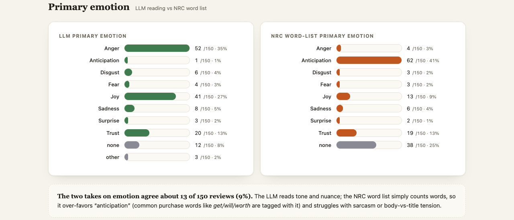
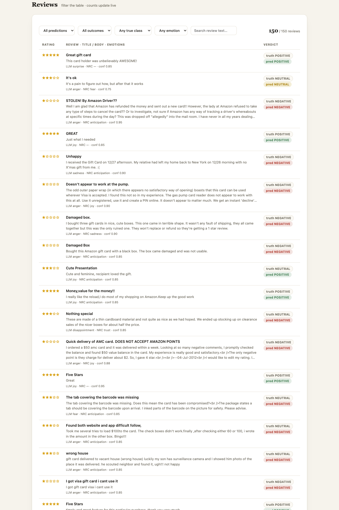

# Amazon Gift-Card Review Sentiment & Emotion Classifier

An LLM-based classifier that reads **Amazon "Gift Cards" reviews**, labels each one
`POSITIVE` / `NEUTRAL` / `NEGATIVE`, names its primary emotion in two independent ways (the
LLM's reading and an NRC word-list score), and checks every prediction against the review's
star rating. All numbers come from a fixed, seeded sample and are shown on a single
self-contained, offline dashboard.

Built for **MBAX 6418 — Assignment 1**, driving the whole build with an agent: the prompt,
scoring, word-list emotion measures, and dashboard were produced and iterated in that
workflow.



## Data source

**Amazon Reviews '23**, “Gift Cards” category — a large-scale review corpus collected by the
**McAuley Lab at UC San Diego**.

- Dataset & field reference: https://amazon-reviews-2023.github.io
- Raw file used: `Gift_Cards.jsonl.gz` (gzipped JSON Lines), downloaded from
  `https://mcauleylab.ucsd.edu/public_datasets/data/amazon_2023/raw/review_categories/`
- **152,410 reviews**, every one with rating, title, body, verified-purchase flag,
  helpful-vote count and timestamp.

The category is **heavily skewed**: ★5 = 128,248 (84.1%), ★4 = 6,692 (4.4%), ★3 = 3,271
(2.1%), ★2 = 1,873 (1.2%), ★1 = 12,326 (8.1%). A model that only ever said "positive" would
already be ~85% "right," so no accuracy number means anything without looking at class balance.

## How it works

1. **Prompt** (`prompt.py`) — a reusable system prompt that takes only a review's *title* and
   *text* (never the rating) and returns strict JSON: `{sentiment, emotion, confidence,
   reason}`. Few-shot examples handle terse reviews and title-vs-body conflicts — the body
   wins (verified: "Loved it" + "complete garbage" → NEGATIVE; "Worst" + "fast shipping, great
   price" → POSITIVE).
2. **Scoring** (`score.py`) — samples reviews, calls the LLM, and scores predictions against
   the "correct answer" derived from the rating:
   - **binary (lopsided) run**: first 100 rows in file order; ★≥4 → POSITIVE, else NEGATIVE.
   - **three-class balanced run (the headline)**: ★4–5 → POSITIVE, ★3 → NEUTRAL, ★1–2 →
     NEGATIVE; **~50 per class**, sampled from the whole file with **seed 42** so the same set
     returns every run.
3. **Word-list emotions** (`nrc_emotions.py`) — a second, model-free take on primary emotion:
   score each review's words against the **NRC Emotion Lexicon v0.92** (anger, anticipation,
   disgust, fear, joy, sadness, surprise, trust), sum per emotion, take the max. Reviews with
   no matching lexicon word are reported as `none` (not guessed).
4. **Dashboard** (`build_dashboard.py`) — emits one self-contained, offline HTML page.

**Endpoint:** OpenAI-compatible class endpoint `http://dobolyi.com:9001/v1`, model
`cyankiwi/Qwen3.6-35B-A3B-AWQ-4bit`, temperature 0. Endpoint, key and model are overridable
via `LLM_BASE_URL` / `LLM_API_KEY` / `LLM_MODEL`. Because the model intermittently returned
empty text (its reasoning consumed the token budget), the scorer retries with varying
configs (reasoning off/on, more tokens, higher temperature) and parallelizes calls.

## Reproduce

```bash
python -m venv .venv && source .venv/bin/activate
pip install -r requirements.txt

# 1. lopsided binary run — the first 100 in file order, mostly ★5 (see how imbalance inflates accuracy)
python score.py --mode binary --sample first --n 100 --out outputs/classify_binary_first100.json

# 2. headline balanced three-class run, seed 42
python score.py --mode three --sample balanced --n-per-class 50 --seed 42 \
    --out outputs/classify_balanced_three.json

# 3. add NRC word-list emotions to a run's output
python nrc_emotions.py --input outputs/classify_balanced_three.json \
                       --out outputs/classify_balanced_three_with_nrc.json --compare

# 4. build the dashboard
python build_dashboard.py --results outputs/classify_balanced_three_with_nrc.json \
                          --out outputs/dashboard.html
```

---

## Results

> Every number below was read back from the saved outputs under `outputs/` and matches what
> the dashboard displays (verified in a browser, not just by eye).

### 1. Why the lopsided run looked so accurate — and what balancing changed

The binary run over the first 100 rows in file order scored **96/100 = 96.0%** against the
rating. That headline is misleading: the batch contains **93 POSITIVE and just 7 NEGATIVE**
reviews, so "agree with the rating" mostly means "agreed that a ★5 review is positive." The
model's recall on the 7 true negatives was **5/7 = 71.4%** — it was weakest on exactly the
reviews that are rare in the file.

The balanced three-class run removes the imbalance by drawing **50 per class**:

| Metric | Balanced three-class |
|---|---|
| Overall accuracy (vs rating) | **107/150 = 71.3%** |
| POSITIVE recall | 46/50 = **92.0%** |
| NEUTRAL recall | 17/50 = **34.0%** |
| NEGATIVE recall | 44/50 = **88.0%** |
| empty model outputs (counted wrong) | 12/150 = 8% |

So the model is genuinely good at the poles (positive 92%, negative 88%) and collapses on the
middle. Balancing turns a hollow 96% into an informative 71.3% — and shows the ★3 problem the
lopsided run hid.

### 2. Where the mistakes go — the confusion matrix

Confusion matrix, rows = correct answer (from rating), columns = model prediction:

```
             POSITIVE  NEUTRAL  NEGATIVE  empty
POSITIVE         46        2        0       2
NEUTRAL           4       17       21       8
NEGATIVE          1        3       44       2
```

The dominant error is **NEUTRAL (★3) leaking into NEGATIVE: 21 of the 50 three-star reviews
(42%) get labeled NEGATIVE**, versus only 4 that get called POSITIVE. Three-star reviews do
*not* hold their own class in this model — they largely **collapse into the negative bucket**,
and 8 more are lost to empty model outputs. Reading the texts explains why: many ★3 gift-card
reviews are written as complaints ("card did not work," "box arrived crushed," "activation
fee") even though the reviewer only knocked it to ★3. Judged purely on *sentiment of the
words* the model is often "fair"; judged on the *rating-as-truth* it is counted wrong. That
gap is an inherent limitation of using the star rating as ground truth — worth knowing when
you interpret any of these numbers.

NEGATIVE→NEUTRAL confusion is rare (only 3), and NEGATIVE→POSITIVE is rarer still (1). The
interesting POSITIVE miss is sarcasm: a ★1 review titled "One Star" whose body reads
**"Terrific presentation!!”** was called POSITIVE — the model read the literal positive words
and missed the sarcasm. Full detail is in the dashboard's Predictions section.



### 3. The two emotion takes, and why they diverge

The LLM's emotion and the NRC word-list emotion agree on only **13/150 = 8.7%** of reviews.
Three systematic reasons:

- **NRC over-favors "anticipation."** It counts words, and high-frequency functional words in
  gift-card reviews — *get, will, would, sent, use* — are tagged "anticipation," so that label
  dominates the word-list distribution regardless of the true tone.
- **NRC can't read tone or sarcasm.** The count-based method has no idea that "Terrific
  presentation!!" under a ★1 is angry; the LLM does.
- **NRC finds nothing in ~25% of reviews.** For 38/150 terse reviews no lexicon word matched,
  and the word list honestly reports `none` where the LLM still read an emotion.

There's also a whispered finding in the LLM row: told to stay inside the eight NRC emotions,
the model occasionally returned something else anyway (2× "disappointment", 1× "confusion") —
even a strong prompt can't always be forced into a closed vocabulary.



### 4. Bugs and issues hit along the way

- **Empty model outputs.** `thinking=False` was intermittently ignored; the model would enter a
  reasoning chain, exhausted `max_tokens`, and return `content=None`. In the first balanced
  run this hit **32/150 = 21%** of reviews. Fix: retry with *varying* configs (reasoning
  off/on, token headroom 900→2600, temperature 0→0.6) plus parallelism; errors fell to
  **12/150 = 8%**.
- **A spurious emotion bug.** My NRC `primary()` broke ties alphabetically, so the 38 reviews
  with *zero* lexicon matches all reported "anger" (alphabetically first) — inflating anger
  and corrupting the emotion comparison. Fix: return `none` when nothing matches.
- **Layout collapse / giant rows (Step 7 trap).** The review-table body had `max-width:46ch`,
  so long complaint texts wrapped into ~10+ lines and pushed rows up to **493px** (the page
  stretched to ~17k px tall). Fix: let text use the full cell and clamp to 3 lines with
  ellipsis (full text on hover); rows now top out at ~125px. Bars were also guarded with
  `min-width:8px` so no small value can render at zero width.
- **HTML injection from review text.** Review bodies contain quotes and markup; interpolating
  them raw broke the `title` attribute. Fix: HTML-escape all injected fields.
- **Process/pipeline slips.** A background scoring run was killed by a missing output dir
  (`tee` failed at spawn); re-running after the dir existed fixed it. Early on I misread the
  balanced run's progress as a hang when it was simply ~5s/review.

## The dashboard

Open `outputs/dashboard.html` in any browser — it's one file, works offline, no server or
network. It shows the headline metrics, a descriptive layer (the star distribution of all
152,410 reviews), predictions-vs-rating (truth vs predicted per class and a confusion
matrix), the LLM-vs-NRC emotion comparison, and a fully filterable review table with a live
row count (by predicted class, correct/mismatched, true class, emotion, or free-text search).



---

## Files

| File | Role |
|---|---|
| `prompt.py` | the structured prompt + strict-JSON parsing |
| `score.py` | sampling + LLM scoring + rating check + metrics (scoring script) |
| `nrc_emotions.py` | NRC word-list emotion scorer (word-list script) |
| `build_dashboard.py` | single-file dashboard generator |
| `outputs/classify_binary_first100.json` | raw binary (lopsided) run — 100 rows |
| `outputs/classify_balanced_three.json` | raw balanced three-class run — 150 rows (seed 42) |
| `outputs/classify_balanced_three_with_nrc.json` | that run + NRC emotions added |
| `outputs/dashboard.html` | **the final dashboard** (open offline in a browser) |
| `outputs/summary_binary.txt` | console summary of the binary run |
| `lexicons/NRC-Emotion-Lexicon-Wordlevel-v0.92.txt` | the public NRC emotion word list |
| `assets/` | dashboard screenshots used in this README |

`data/Gift_Cards.jsonl.gz` (12 MB) is intentionally **not** committed — it re-downloads from
the link above. No personal credentials are in the repo (the endpoint key is the class-shared
constant, and it's overridable by environment variable).

---
*Data: Amazon Reviews '23, © the McAuley Lab (UC San Diego), released for academic use.
NRC Emotion Lexicon v0.92, © Saif Mohammad / National Research Council Canada.*
